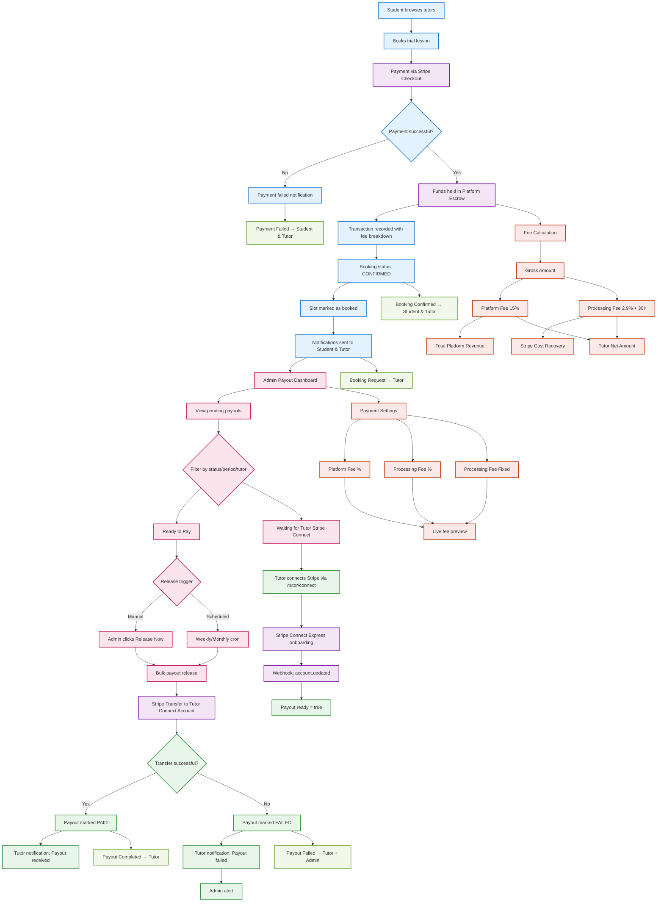

### Payment Flow Summary

| Stage | Actor | Action | Data Stored |
|-------|-------|--------|-------------|
| **1. Booking** | Student | Books lesson, pays via Stripe | `Booking` (PENDING_PAYMENT), `Transaction` (SUCCESS) |
| **2. Escrow** | Platform | Holds funds, calculates fees | Fee breakdown in `Transaction` |
| **3. Completion** | Tutor/Student | Lesson completes | `Booking` (COMPLETED) |
| **4. Payout** | Admin | Releases funds to tutor | `Payout` record, Stripe Transfer |
| **5. Settlement** | Stripe | Transfers to tutor Connect | `Transfer` webhook updates `Payout` |

### Key Features Implemented
- ✅ **Escrow**: Student payments go to platform first
- ✅ **Multi-fee**: Platform % + Processing % + Fixed
- ✅ **Admin control**: Weekly/monthly bulk releases
- ✅ **Stripe Connect**: Tutor onboarding for payouts
- ✅ **Notifications**: All events trigger in-app alerts
- ✅ **Audit trail**: Complete `Transaction` + `Payout` history
- ✅ **Configurable fees**: Live preview in admin settings